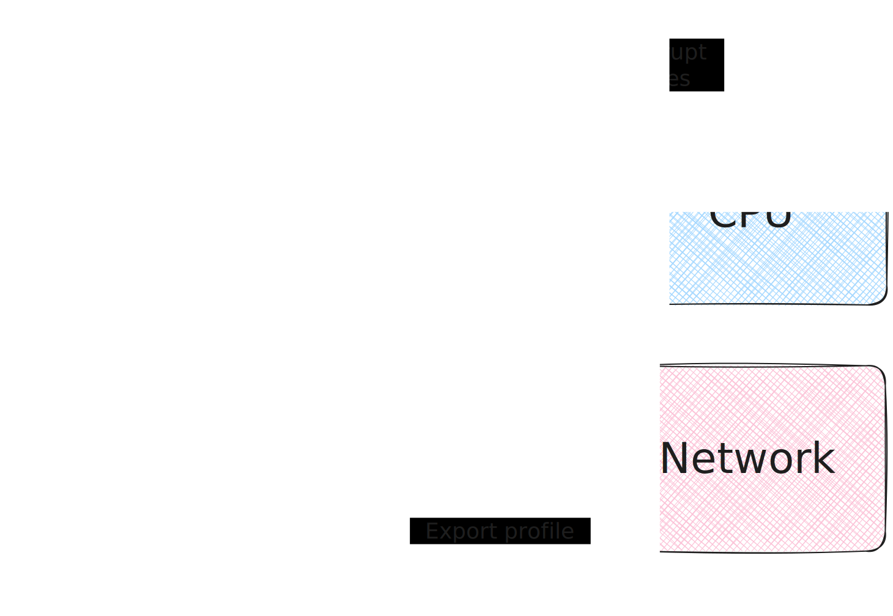

# Architecture overview

This page describes Perforator's architecture.

## Intro
Perforator consists of several components. There are four different kinds of components:
1. Perforator agent which is running on each node of the profiled cluster
2. A few microservices to collect, store, analyze, and symbolize profiles & executable files from the agents. We run our microservices inside the same cluster Perforator profiles.
3. A web-based user interface.
4. A set of databases: ClickHouse to store profile metadata, PostgreSQL to store binary metadata, and S3-compatible store to store raw profiles and binaries.

Such design has been proven to be effective enough to scale to tens of thousands of nodes and petabytes of profiles.

## High-level schema

## Components overview

### Agent
The Perforator agent is the core of our profiling infrastructure. The agent runs on each node inside the cluster, collects profiles using eBPF, aggregates, compresses and sends them to the storage via gRPC in the pprof-compatible format.

Agent connects to kubelet to identify running pods on a node. Also agent tracks all the processes on a node and analyzes running executables. To profile, the agent uses [perf_events Linux API](https://man7.org/linux/man-pages/man2/perf_event_open.2.html) to trigger eBPF program on each perf event like "1M CPU cycles" or "1K major pagefaults". The eBPF program collects info about thread it was invoked on like thread / process id, thread / process name, userspace & kernelspace call stack and so on. The program sends collected samples to the user-space part of the agent via eBPF perfbuf API.

Agent collects samples from the eBPF program in memory and periodically sends them to the storage over gRPC. By default, for each pod an agent will send a profile every minute. We call this profile, consisting of the samples of one workload over one minute, an *atomic profile*.

In order to generate human-readable profile, the agent should map addresses of executable instructions to source code lines. That process, called *symbolization*, is compute-intensive. If the same code is executed on thousands of nodes, the agent should run the same symbolization on each node, which is proven to be really expensive. So we took another approach.

In addition to profiles, agent uploads executable files found on the profiled nodes. This can sound scary, but with careful synchronization we guarantee that each binary file is uploaded only once. The binaries are uploaded through storage microservice to S3 and PostgreSQL storages, and can be post-processed later to generate symbolized profiles. Binary files are identified using *build-id*: unique identifier of the compiled binary, which is often computed as a hash of meaningful ELF sections. Some executables do not contain build-id, so we compute so-called *pseudo build-id*: hash based on a few random portions of executable text.



While in theory we can support external artifact registries, this feature is not available now. Feel free to discuss and contribute.



### Databases
Perforator uses three different storages. All the other microservices are stateless.
- Raw atomic profiles, binaries, and some post-processed artifacts of binaries (GSYM data) are stored in the S3-compatible storage. S3 is cheap and scales well.
- For each atomic profile we write a row to the ClickHouse cluster. This allows us to quickly find interesting profiles using complex selectors, because ClickHouse is blazing fast. See [ClickHouse table structure](https://github.com/yandex/perforator/tree/main/perforator/cmd/migrate/migrations/clickhouse) for details.
- For each executable file we write a row to the PostgreSQL cluster to synchronize uploads and track binary TTL. We have found that there is not too many executable files and they can be easily stored in an PostgreSQL. However, it is quite easy to use your custom SQL database instead (probably a few hundred lines of Golang). See the source code for details.

For more details about database structure see [database reference](../../reference/database.md).

### Storage proxy
Storage is a simple gRPC server that proxies upload requests from agents to ClickHouse, PostgreSQL and S3. Storage proxy is stateless, despite the name, and can (and should!) safely be replicated. We run hundreds of storage pods in our largest cluster. Storage can optionally provide agent authorization using mTLS.

### Symbolizer
Symbolizer (or *proxy* in the source code) is a main user-facing service. Symbolizer allows user to list profiles or services, build merged profiles that span multiple atomic profiles matching one selector and so on. Symbolizer consumes a noticeable amount of resources: symbolization is heavy. We are working to optimize this. Likely the symbolizer itself is often running in the same cluster we profile and can be easily self-profiled.

Symbolizer provides two variants of the same API: raw gRPC interface and HTTP RPC using beautiful [grpc-gateway](https://github.com/grpc-ecosystem/grpc-gateway/). The gRPC interface can be used by CLIs and automated services like profile quality monitors while HTTP API is used by our web interface.
