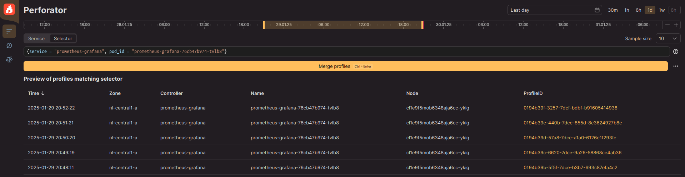

# Query Language

When you're profiling an application, you almost always want to filter the profiles by some properties. For instance, you might need to select only samples from a specific pod that were collected at a specific time. The query language used in Perforator can help you with that.


## Selector

To make a query to the profile database, you need to build a *selector*. Here is a simple example of one:
```
{service="perforator.storage-production", timestamp>="now-30m"}
```

The result of this query would be a set of profiles collected in the last 30 minutes from the service called `perforator.storage-production`.

As you can see, a number of *labels* and their corresponding *values* are specified in a selector. A label is a property of a collected profile, e.g. `service`, `pod_id`, `cpu` (you can find a list of them further down on this page). And a value can be a string or a regex.

You can enter the selector in the input field in the UI. After that, you'll see the matching profiles in the table below it. If you click on the “Merge profiles” button, you'll get to the page with the rendered flamegraph of the merged profile.



Alternatively, you can set a selector to build a profile in [the CLI](../guides/cli/fetch.md).


## Supported fields

Here are the most useful labels that are supported in the query language. There are several others, but they are very internal and chances are you will never need them.

| Name         | Description                                                                                                   | Examples                                                             |
|--------------|---------------------------------------------------------------------------------------------------------------|----------------------------------------------------------------------|
| `service`    | [Deployment](https://kubernetes.io/docs/concepts/workloads/controllers/deployment/) / service / a set of pods | `{service="perforator-agent"}`                                       |
| `cluster`    | [Availability zone](https://kubernetes.io/docs/setup/best-practices/multiple-zones/) / data center / cluster  | `{cluster="nl-central1-a}"`                                          |
| `pod_id`     | [Pod](https://kubernetes.io/docs/concepts/workloads/pods/)                                                    | `{pod_id="perforator-agent-f00d"}`                                   |
| `node_id`    | [Node](https://kubernetes.io/docs/concepts/architecture/nodes/)                                               | `{node_id="cl1e9f5mob6348aja6cc-beef"}`                              |
| `cpu`        | Model of CPU used on the node                                                                                 | `{cpu=~"AMD EPYC .*"}`                                               |
| `id`         | Profile ID<br/>Can be useful if you know exactly which atomic profile you want to inspect                     | `{id="0194b346-e2d9-7dcc-b613-a222fbbc9682}"`                        |
| `timestamp`  | Profile collection time                                                                                       | `{timestamp>"now-30m"}`<br/>`{timestamp<"2025-01-30T07:31:41.159Z"}` |
| `event_type` | Event used to collect a profile<br/>Possible values: `cpu.cycles`, `signal.count`, `wall.seconds`             | `{event_type="cpu.cycles"}`                                          |
| `build_ids`  | ELF Build ID of an executable file used in a profile                                                          | `{build_ids="4b1d"}`                                                 |
| `tls.KEY`    | TLS variable                                                                                                  | `{tls.KEY="value"}`                                                  |


## Supported operators

The most common way to find profiles is by using exact matching. After all, in most cases you know the value of the property that you wish to find. But there are some other ways which are supported through different operators.

| Operator             | Description              | Examples                                                                                                                                                                                                                                                  |
|----------------------|--------------------------|-----------------------------------------------------------------------------------------------------------------------------------------------------------------------------------------------------------------------------------------------------------|
| `=`, `!=`            | Exact matching operators | `{cluster="nl-central1-a"}`<br/>Profiles from the `nl-central1-a` zone<br/><br/>`{service!="mongodb"}`<br/>Profiles from everywhere except `mongodb` deployment<br/><br/>`{service="grafana\|mongo"}`<br/>Profiles from `grafana` and `mongo` deployments |
| `=~`, `!~`           | Regex matching operators | `{cpu=~"Intel.*"}`<br/>Profiles from the pods with Intel processors<br/><br/>`{service!~"perforator-.*-testing"}`<br/>Profiles that are not from the testing deployments                                                                                  |
| `<`, `>`, `<=`, `>=` | Ordinal operators        | `{timestamp<"now-1d"}`<br/>Profiles that are at least 24 hours old


## More complex examples

- `{service="perforator-agent", cpu=~"AMD.*"}`<br/>
  Profiles collected from the pods of the `perforator-agent` deployment which are using AMD processors
- `{cluster="us-central-1b", timestamp>="now-3h", timestamp<"2h"}`<br/>
  Profiles from the `us-central-1b` zone that were collected between 2 and 3 hours ago
- `{pod_id="perforator-agent-f00d", event_type="signal.count"}`<br/>
  Profiles collected on fatal signals from the `perforator-agent-f00d` pod
- `{build_ids="4b1d|c0de", node_id="cl1e9f5mob6348aja6cc-beef"}`<br/>
  Profiles for executable files with ELF build IDs `4b1d` or `c0de` that were collected from the `cl1e9f5mob6348aja6cc-beef` node
