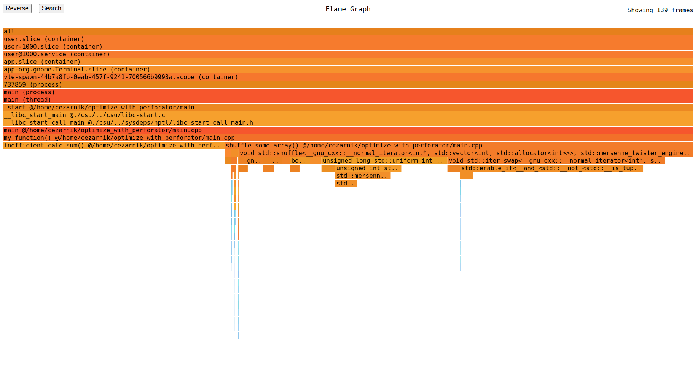
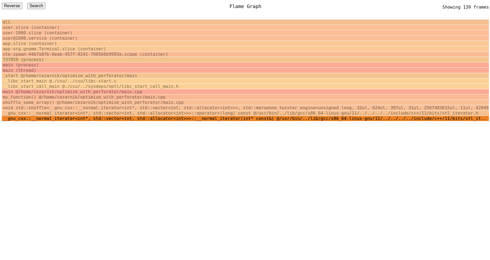
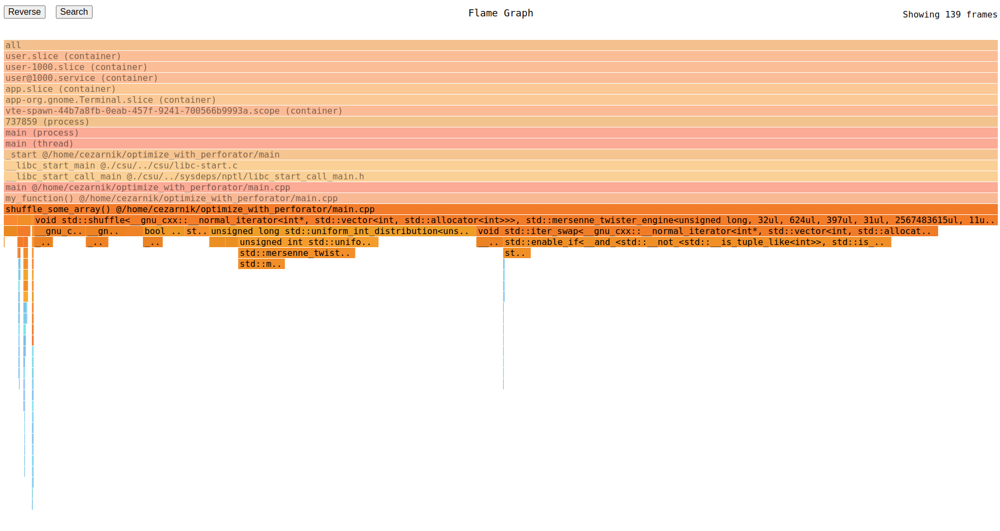
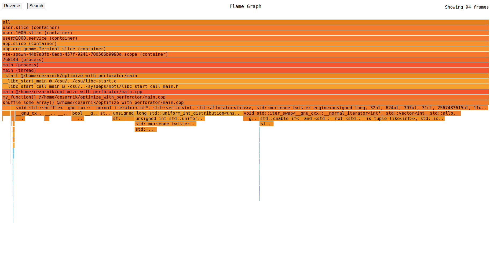

# Optimizing Native Applications with Perforator

In this tutorial we will optimize a simple C++ application using Perforator. We will build an app, view its flamegraph and see how we can improve the performance.

## Prerequisites

- Any Linux amd64 OS with 5.4+ kernel;
- `python` 3.12+ interpreter for building Perforator CLI (or already downloaded Perforator CLI);
- `clang++` 14+ for building C++ app.


## Running the application

Let's optimize the following code:

```C++
#include <algorithm>
#include <cstdint>
#include <iostream>
#include <random>
#include <vector>

uint64_t inefficient_calc_sum() {
  uint64_t result = 0;
  for (int i = 1; i <= 1'000'000'000; ++i) {
    result += i;
  }
  return result;
}

void shuffle_some_array() {
  std::vector<int> vec;
  for (int i = 0; i < 3'000'000; ++i) {
    vec.push_back(std::rand());
  }
  for (int i = 0; i < 20; ++i) {
    std::shuffle(vec.begin(), vec.end(), std::mt19937());
  }
}

void my_function() {
  shuffle_some_array();
  std::cout << inefficient_calc_sum() << std::endl;
}

int main() {
  for (int i = 0; i < 10; ++i) {
    std::cout << "Iteration:" << i << " ";
    my_function();
  }
  return 0;
}

```

Let's put this code in `~/optimize_with_perforator/main.cpp`, build it and run it with time:

```bash
mkdir -p ~/optimize_with_perforator && cd ~/optimize_with_perforator
clang++ -g main.cpp -o main && time ./main
Iteration:0 500000000500000000
Iteration:1 500000000500000000
Iteration:2 500000000500000000
Iteration:3 500000000500000000
Iteration:4 500000000500000000
./main  17.24s user 0.04s system 99% cpu 17.288 total
```
Notice we build with -g flag to add debug information to binary - with it the analysis will show us more.
17 seconds for executing a simple program is a bit too much.
We can see multiple optimization opportunities here, but it is not obvious where is the performance bottleneck.
Let's find and optimize it!

## Analyzing the performance using Perforator CLI

For analysis we need Perforator CLI. Either download it into `~/optimize_with_perforator` from [releases page](https://github.com/yandex/perforator/releases) or build it from Perforator repo using Ya:

```bash
git clone https://github.com/yandex/perforator.git
cd perforator
./ya make perforator/cmd/cli
cd ~/optimize_with_perforator
ln -s perforator/perforator/cmd/cli/perforator perforator
```
After build, we make symlink to CLI for convenience.
After getting the CLI, run Perforator CLI under sudo:

```bash
sudo ./perforator record --serve :1234 -- ./main
```

This command records stacks from running command you specified after `--`, and in the end it shows you a static page hosted at `localhost:1234`.
Let's type `localhost:1234` in browser in the new tab. We will see the _flamegraph_.



### A few words about flamegraph
Flamegraph is one way of viewing the details of CPU consumption by your apps. Given a number of processes' stacks, which were collected every small period of time (in Perforator it is 10ms), we draw each of them separately as a one-width rectangle stack with each rectangle equal to one stack callframe, like this:



The stack can be read from top to bottom, that is, `main` calls `my_function`, which in turn calls `shuffle_some_array` and so on.

And to draw them all together, we draw them by putting stacks with common prefix together, forming a wider common parts and thinner differing ones. From the construction process it can be seen that the order of columns in flamegraphs does not matter, what matters is the width of the specific rectangle - the wider the rectangle, the more portion of CPU it consumes.

The flamegraph is _interactive_ - you can click on the frame and it will show all stacks having this frame in their prefix. For example, let's click on `shuffle_some_array`:



You can return to the original flamegraph by clicking on the root frame (all).
We've played with flamegraph a bit, let's move to optimizing the app!

### Optimizing the app
Looking at the level under `my_function`, we see that the most CPU consuming functions are `inefficient_calc_sum` and `shuffle_some_array`. `shuffle_some_array` in turn has `std::shuffle` as the most consuming function, so we do not really hope to optimize it easily. Let's look at the `inefficient_calc_sum`. There is no children in it (except some blue small kernel interrupt-related code on the left), so it is the code inside this function which burns so much CPU! Obviously, it's the loop. We can notice that the function can be rewritten in much more efficient way:

```C++
uint64_t inefficient_calc_sum() {
  // uint64_t result = 0;
  // for (int i = 1; i <= 1'000'000'000; ++i) {
  //  result += i;
  // }
  // return result;
  return 1ll * (1 + 1'000'000'000) * 1'000'000'000 / 2;
}
```

Let's recompile the code and see the flamegraph again:

```bash
clang++ -g main.cpp -o main
sudo ./perforator record --serve :1234 -- ./main
```



The `inefficient_calc_sum` became so efficient that Perforator's sampling period wasn't enough to record even one sample.

Let's measure the execution time of `main`:
```bash
time ./main
Iteration:0 500000000500000000
Iteration:1 500000000500000000
Iteration:2 500000000500000000
Iteration:3 500000000500000000
Iteration:4 500000000500000000
./main  11.81s user 0.06s system 99% cpu 11.885 total
```

We reduced execution time by 6 seconds, great!
