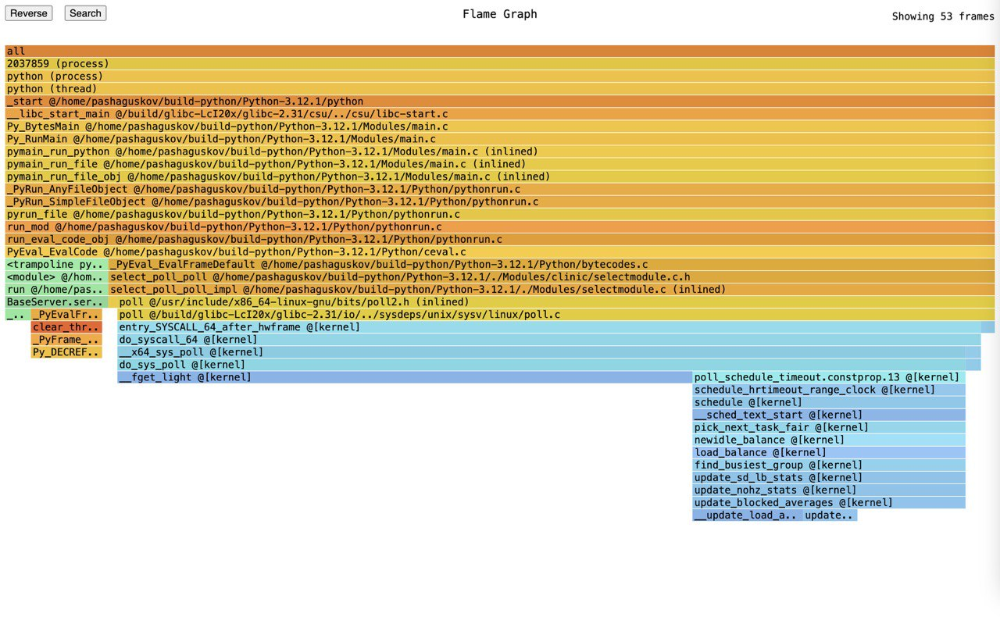
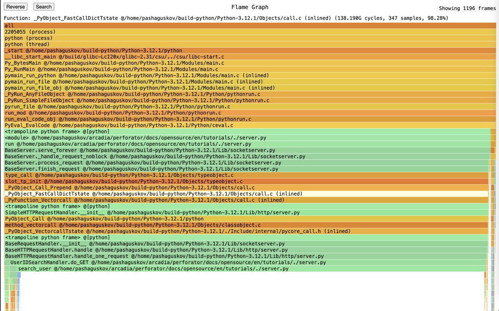
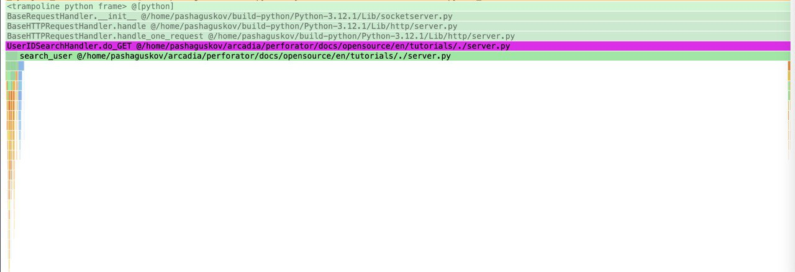
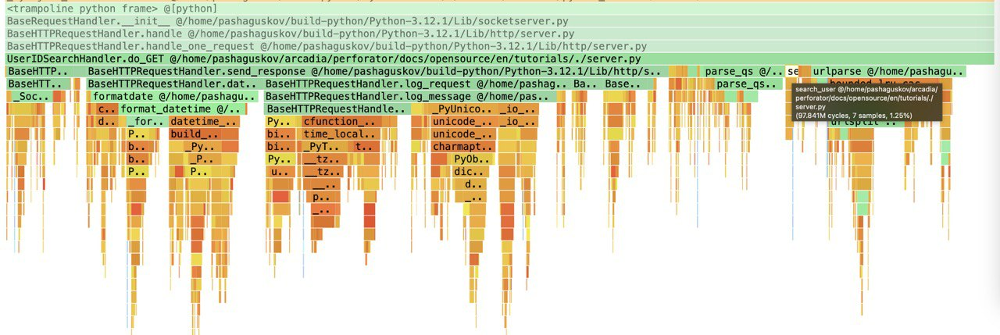

# Optimizing Python Applications with Perforator

In this tutorial we will optimize a simple Python application using Perforator. We will view the flamegraph of the application and see how we can improve the performance.

## Prerequisites

- `perforator` CLI
- `python` 3.12+ interpreter
- `curl` HTTP client

## Running the application

Let's say we have a simple Python HTTP server that has exactly one handler `UserIDSearchHandler`. This handler checks if the user exists.

```python
import http.server
import socketserver
import os
from urllib.parse import urlparse, parse_qs

PORT = 9007

# Create a large sorted array of user IDs (not necessarily consecutive)
user_ids = list(range(1, 1000000, 2))  # Example: [1, 3, 5, ..., 999999]

# Global variable to count the number of requests
request_count = 0

def increment_request_count():
    global request_count
    request_count += 1

def search_user(arr, target):
    # Simple linear search
    for value in arr:
        if value == target:
            return True
    return False

class UserIDSearchHandler(http.server.SimpleHTTPRequestHandler):
    def do_GET(self):
        increment_request_count()

        if self.path.startswith('/search_user'):
            query_components = parse_qs(urlparse(self.path).query)
            user_id = int(query_components.get("user_id", [0])[0])

            exists = search_user(user_ids, user_id)

            self.send_response(200)
            self.send_header("Content-type", "text/plain")
            self.end_headers()
            if exists:
                response = f"The user {user_id} exists. Request ID: {request_count}\n"
            else:
                response = f"The user {user_id} does not exist. Request ID: {request_count}\n"
            self.wfile.write(response.encode())
        else:
            self.send_response(404)
            self.end_headers()

def run(server_class=http.server.HTTPServer, handler_class=UserIDSearchHandler):
    with server_class(("", PORT), handler_class) as httpd:
        print(f"Serving on port {PORT}")
        httpd.serve_forever()

if __name__ == "__main__":
    print(f"My pid is {os.getpid()}")
    run()
```

We can assume that `user_ids` is retrieved from a database, but for the sake of simplicity we will just use a sorted pre-generated list.

Copy this code to a file `server.py` and run it.

```bash
python server.py
```

You should see something like this:

```console
-$ python server.py
My pid is 3090163
Serving on port 9007
```

Let's send a request to the server and check if user with ID 13 exists.

```console
$ curl "http://localhost:9007/search_user?user_id=13"
The user 13 exists
```

Now we have a simple working Python application.

## Recording a flamegraph

We can collect a flamegraph which is a visual representation of the program's execution.

`perforator record` collects stacks from the desired process for some time and then generates a flamegraph. You can read more about it [here](../guides/cli/record.md).

Let's collect a flamegraph of the application. But do not forget to replace the `--pid` with the PID of your application.

```console
$ sudo perforator record --pid 3090163 --duration 1m --serve ":9006"
```

You should see the output with a lot of information about the system analysis. But the most important part is the URL of the flamegraph. Paste it in your browser and open it (e.g. `http://localhost:9006`).


You would see the flamegraph like this.



We can notice that there is no `UserIDSearchHandler` in the flamegraph. This is during the flamegraph collection the server handler was not executing.



The program must be executing the code that we want to profile during the flamegraph collection.



So for this example we should be sending requests to the server during the flamegraph collection.

## Loading the application

Let's load the application handler with a simple python script.

```python
import requests
import random

while True:
    user_id = random.randint(1, 1000000)
    requests.get(f"http://localhost:9007/search_user?user_id={user_id}")
```

Run this in a separate terminal.

## Collect the meaningful flamegraph and find the bottleneck

```console
$ sudo perforator record --pid 3090163 --duration 1m --serve ":9006"
```

Now we can see the flamegraph which looks like this.



As we want to optimize the `UserIDSearchHandler` we should focus on the part of the flamegraph which corresponds to this handler.

Click "Search" in the top left corner and paste "UserIDSearchHandler" in the search bar. Then click on the `UserIDSearchHandler` in the flamegraph.



We can see that `search_user` block is really long, it means that it takes the majority of CPU time of the handler which is a parent block.

Let's notice that we can replace the linear search by a lookup into the precomputed dictionary.

## Optimizing the bottleneck

Now let's modify the code to use a dictionary instead of a linear search.

```python
import http.server
import socketserver
import os
from urllib.parse import urlparse, parse_qs

PORT = 9007

# Create a large sorted array of user IDs (not necessarily consecutive)
user_ids = list(range(1, 1000000, 2))  # Example: [1, 3, 5, ..., 999999]

# Build a dictionary for quick lookup
user_id_dict = {user_id: True for user_id in user_ids}

# Global variable to count the number of requests
request_count = 0

def increment_request_count():
    global request_count
    request_count += 1

def search_user(arr, target):
    return user_id_dict.get(target, False)

class UserIDSearchHandler(http.server.SimpleHTTPRequestHandler):
    def do_GET(self):
        increment_request_count()

        if self.path.startswith('/search_user'):
            query_components = parse_qs(urlparse(self.path).query)
            user_id = int(query_components.get("user_id", [0])[0])

            exists = search_user(user_ids, user_id)

            self.send_response(200)
            self.send_header("Content-type", "text/plain")
            self.end_headers()
            if exists:
                response = f"The user {user_id} exists. Request ID: {request_count}\n"
            else:
                response = f"The user {user_id} does not exist. Request ID: {request_count}\n"
            self.wfile.write(response.encode())
        else:
            self.send_response(404)
            self.end_headers()

def run(server_class=http.server.HTTPServer, handler_class=UserIDSearchHandler):
    with server_class(("", PORT), handler_class) as httpd:
        print(f"Serving on port {PORT}")
        httpd.serve_forever()

if __name__ == "__main__":
    print(f"My pid is {os.getpid()}")
    run()
```

Run this server, run the load script and collect the flamegraph again.

We will see the flamegraph of `UserIDSearchHandler` with a significantly smaller `search_user` block.



Now the `UserIDSearchHandler` takes 26.30% of the CPU time of the program instead of 96.22% as before.

From this process we can see that the flamegraph is useful for comparing relative performance of different parts of the program by looking at the sizes of the blocks.

## Conclusion

In this tutorial we

* Used `perforator record` to profile the application
* Collected a meaningful flamegraph with the application loaded
* Navigated the flamegraph to find the bottleneck
* Optimized the application handler

We can see that the flamegraph is a useful tool for profiling and optimizing the performance of the application.
