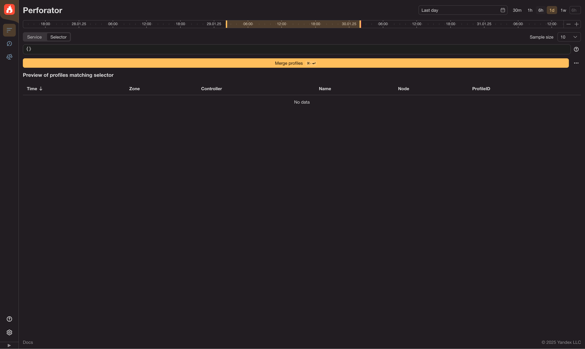
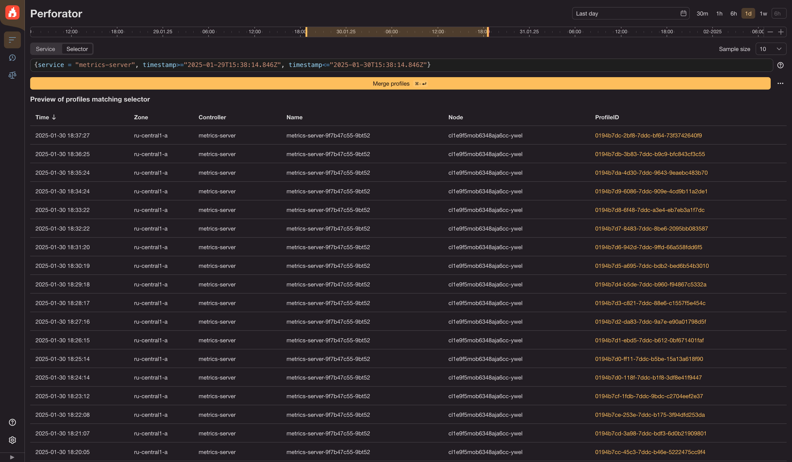
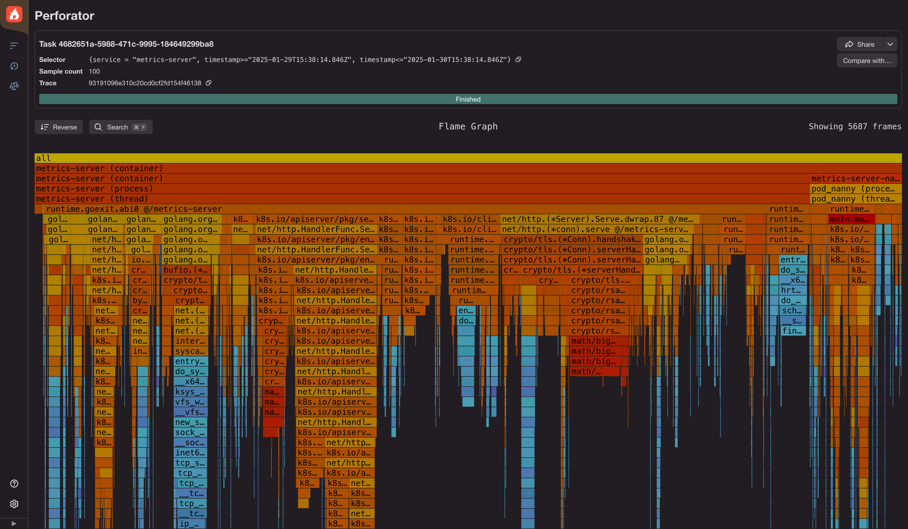
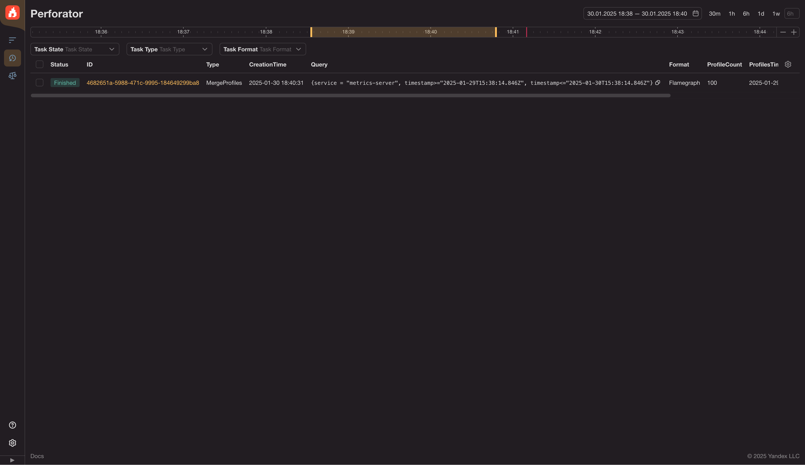

# Building your first profile with Perforator UI

You've deployed perforator to your experimental kubernetes cluster and not sure what to do next?
This article will guide you through basic operations related to the UI. You will
- Create a flamegraph
- Inspect a flamegraph
- Find previously created flamegraphs

## Prerequisites

- App deployed into k8s cluster(for example, according to the [guide](../guides/helm-chart.md)) network access to Perforator
- some kind of a cpu-heavy workload that is being monitored by perforator agent, for example perforator `cpu_burner`

## Navigating the UI

### Merge profiles form page

Once you open the UI, you will see the start page with an empty field for a selector waiting for you to start typing.

To see the list of already-collected profiles that that can be used for a flamegraph type in `{service="your-service-name"}`. If you are unsure about the name of the service and what `service` means, you can rely on auto-complete.

See further instructions on perforator querylang [here](../reference/querylang.md). It can be used to switch the profile type from default (cycles) to wall time profiling and other perf events, and many other things.

Once you select a service, you will see a table with all the profiles collected for such a selector. 

If you click the profile id link, a flamegraph will be built right away. It will come with the profile id inlined into the selector.

### Aggregation settings

The "Merge profiles" button starts aggregation of the profiles to build a flamegraph. You can configure the amount of profiles that will end up in that merged flamegraph with the "Sample size" selector. You can also change the time interval that is used to pick profiles for aggregation by changing the selected portion of the timeline, or by changing time intervals manually.

Note that the bigger the sample size the longer it will take to merge and build a flamegraph.

Once you click the "Merge profiles" button, you will be redirected to the flamegraph page. At first, you will see the progress bar while flamegraph is being prepared, and after a while you will see the flamegraph.

## Flamegraph

## History

Once the flamegraph has been built, it will be accessible via the history tab (button on the left with an arrow back and a clock).

