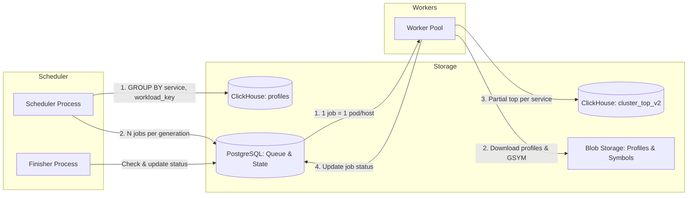

# Cluster Top



This doc is AI-generated. It can serve, in particular, as a summarized context of how the component works.



## Overview

The **Cluster Top** component is responsible for pre-calculating and aggregating the top functions across all profiles for each service over specific time intervals, which are called *generations*.

This is necessary for the fast display of the cluster top in the user interface (UI) without having to download and aggregate thousands of raw profiles "on the fly".

## Job Model

A **job** is one `(service, workload)` pair within a generation:

| Workload type | `pod_id` | `node_id` | Example |
|---------------|----------|-----------|---------|
| Kubernetes pod | set | empty | regular service pod |
| Host agent | empty | set | `service=perforator`, profiles keyed by host |

**Workload key** = `coalesce(nullIf(pod_id, ''), node_id)` — used for discovery grouping and the unique index on `cluster_top_jobs`.

Multiple jobs for the same service (one per pod) write **partial** tops to ClickHouse. `cluster_top_v2` uses `SummingMergeTree`, so the UI reads the merged service-level top after all pod jobs complete.

## Architecture and Databases

The Cluster Top relies on two main databases:

1. **PostgreSQL** — used as a job queue and to store the state of generations:

   - `cluster_top_generations` — stores information about generations (generation ID, time interval `from_ts` / `to_ts`, status `scheduled` or `finished`).
   - `cluster_top_jobs` — the queue of jobs to be processed within a generation. Each row is one workload (pod or host agent) for a service. Contains `pod_id`, `node_id`, `profiles_count`, and execution status (`pending`, `done`, `failed`, `skipped`). Time range comes from the linked generation in `cluster_top_generations` (not stored on the job row). Schema: [024_cluster_top_jobs.up.sql](../../../cmd/migrate/migrations/postgres/024_cluster_top_jobs.up.sql).
     - Unique per generation: `(generation, service, coalesce(nullif(pod_id, ''), node_id))`.
     - Partial index for worker pickup: `(profiles_count DESC) WHERE status = 'pending'`.
   - `cluster_top_services` — legacy whole-service queue kept for rollback safety; no longer populated by the scheduler.

2. **ClickHouse** — acts as the source of data about existing profiles and the target storage for the aggregated results:

   - The initial data is taken from the profile metadata table `profiles`.
   - The results are written to `cluster_top_v2` (SummingMergeTree), which stores pre-calculated values (generation, service, function, self cycles, cumulative cycles). Materialized views `cluster_top_by_function_v2` and `cluster_top_generation_totals_v2` are updated automatically.

## Main Components

### Scheduler

The [Scheduler](./scheduler/scheduler.go) is responsible for regularly creating new generations and populating the job queue. Discovery logic lives in [discover_jobs.go](./scheduler/discover_jobs.go) and [filters.go](./scheduler/filters.go).

- **Run interval:** once a minute (using a distributed lock - lease).
- **Execution logic:**
  - Calculates the time interval for the next generation, taking into account the `ProfileLag` (profile arrival delay) and `GenerationInterval` (duration of the generation itself) settings.
  - Queries the `profiles` table in ClickHouse with `GROUP BY service, workload_key` for **all** services and workloads in the window (no top-N limit).
  - **Discovery filters** (ClickHouse `profiles`):
    - `system_name = 'perforator'`, `event_type = cpu.cycles`
    - continuous CPU only: `custom_profiling_operation_id = ''`
    - non-empty workload: `coalesce(nullIf(pod_id, ''), node_id) != ''`
  - **Pod vs host normalization:** if any profile in the group has non-empty `pod_id`, the job is pod-scoped (`pod_id` set, `node_id` empty); otherwise it is host-scoped (`node_id` set, `pod_id` empty).
  - Creates a new record in PostgreSQL in the `cluster_top_generations` table with the `scheduled` status.
  - Populates the `cluster_top_jobs` table with jobs (status `pending`).
  - **Backpressure:** does not schedule a new generation while any generation remains in `scheduled` status (previous generation not yet `finished`).
- **Generation Finisher:** a background process in the scheduler that checks every 30 seconds if all jobs in a generation have been processed (no records with the `pending` status). Jobs in `skipped` do not block finishing. If all jobs are processed, the generation's status is changed to `finished`. Also updates queue-depth gauges (`jobs.pending.count`, `generations.scheduled.count`).

### Worker

The Workers are responsible for the actual data aggregation. They run concurrently in a single pool, taking jobs from PostgreSQL. The main logic is located in [cluster_top.go](./cluster_top.go).

- **Job selection:** a worker takes a job from the `cluster_top_jobs` queue using `SELECT ... FOR UPDATE OF j SKIP LOCKED` with a join to `cluster_top_generations` for the time window, preferring jobs with more profiles (`profiles_count DESC`). See [PgJobSelector](./pg_job_selector.go).
- **Profile fetch filters** (via `ProfileStorage` selector in `buildSelector`):
  - same continuous-CPU CPO filter as the scheduler
  - scope by `pod_id` or `node_id` depending on job type
- **Service skip list:** configurable via `worker.skipped_services` in the offline-processing config. If a picked job's `service` is on the skip list, the worker skips processing and marks the job `skipped` (no GSYM download, no ClickHouse write).
- **Edge cases:**
  - **Empty job:** if all profiles were filtered out at fetch time, the job is marked `done` with a warning — no ClickHouse write.
  - **Skipped service:** job is marked `skipped` immediately after pickup.
  - **Concurrency safety:** `FOR UPDATE OF j SKIP LOCKED` ensures one worker per job.
- **Processing steps:**

  1. Fetches profile metadata for the job's service, time range, and workload scope (`pod_id` or `node_id` for host agents) via `ProfileStorage`.
  2. Downloads the necessary symbol files (GSYM) for the binaries found in the profiles via `ClusterTopSymbolizer`.
  3. Downloads the raw profiles in batches from Blob Storage.
  4. Aggregates the profiles in parallel within the job: builds call trees and extracts the top functions, calculating `self_cycles` and `cumulative_cycles`.
  5. Saves the aggregated result to ClickHouse in `cluster_top_v2` via [ClickhousePerfTopAggregator](./clickhouse_perf_top_aggregator.go).
  6. Updates the job status in PostgreSQL to `done` (or `failed` in case of an error, or `skipped` for services on the skip list).

### Asynchronous ClickHouse inserts

Cluster Top always buffers its per-job writes using ClickHouse asynchronous inserts. The configured minimum and maximum adaptive busy timeouts and maximum buffered data size are attached only to `cluster_top_v2` INSERT queries. They do not change the shared ClickHouse connection defaults or the `profiles` write path. If a value is omitted, ClickHouse uses its server default.

ClickHouse starts the adaptive timeout at `busy_timeout_min` and adjusts it up to `busy_timeout_max` based on the INSERT arrival rate. Cluster Top does not configure `async_insert_max_query_number`: in ClickHouse 25.8 that threshold only triggers when asynchronous insert deduplication is enabled, which is not used for these INSERTs.

The worker always uses `wait_for_async_insert=1`. `SaveClusterTopEntry` therefore returns successfully only after ClickHouse has flushed the buffered INSERT, and only then can the PostgreSQL job be marked `done`.

INSERT retries are disabled unless `retryable_error_codes` is configured. Production and prestable retry only error code 252 (`Too many parts`) with bounded exponential backoff and jitter. Other errors are returned immediately because their insert outcome may be ambiguous.

```yaml
storage:
  cluster_top:
    async_insert:
      busy_timeout_min: "2s"
      busy_timeout_max: "5s"
      max_data_size: 268435456
      insert_retries:
        initial_backoff: "1s"
        max_backoff: "30s"
        max_elapsed_time: "30m"
        retryable_error_codes: [252]
```

## Worker config

```yaml
worker:
  skipped_services:
    - service-a
    - service-b
```

## Architecture


