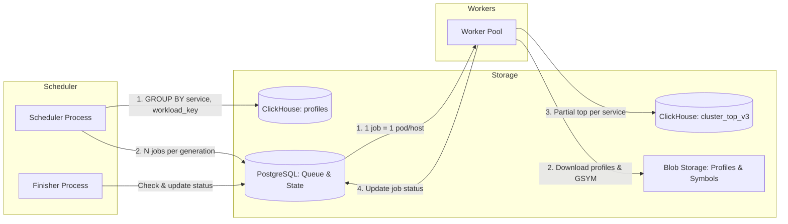

# Cluster Top



This doc is AI-generated. It can serve, in particular, as a summarized context of how the component works.



## Overview

The **Cluster Top** component is responsible for pre-calculating and aggregating the top functions across all profiles for each service over specific time intervals, which are called *generations*.

This is necessary for the fast display of the cluster top in the user interface (UI) without having to download and aggregate thousands of raw profiles "on the fly".

## Job Model

A **job** is one `(service, workload)` pair within a generation:

| Workload type | `pod_id` | `node_id` | Example |
|---------------|----------|-----------|---------|
| Kubernetes pod | set | empty | regular service pod |
| Host agent | empty | set | `service=perforator`, profiles keyed by host |

**Workload key** = `coalesce(nullIf(pod_id, ''), node_id)` — used for discovery grouping and the unique index on `cluster_top_jobs`.

Multiple jobs for the same service (one per pod) write **partial** tops to `cluster_top_v3` (`SummingMergeTree`). Reads sum these contributions across buckets and unmerged rows.

## Architecture and Databases

The Cluster Top relies on two main databases:

1. **PostgreSQL** — used as a job queue and to store the state of generations:

   - `cluster_top_generations` — stores information about generations (generation ID, time interval `from_ts` / `to_ts`, status `scheduled` or `finished`).
   - `cluster_top_jobs` — the queue of jobs to be processed within a generation. Each row is one workload (pod or host agent) for a service. Contains `pod_id`, `node_id`, `profiles_count`, and execution status (`pending`, `running`, `done`, `failed`, `skipped`). Time range comes from the linked generation in `cluster_top_generations` (not stored on the job row). Schema: [024_cluster_top_jobs.up.sql](../../../cmd/migrate/migrations/postgres/024_cluster_top_jobs.up.sql).
     - Unique per generation: `(generation, service, coalesce(nullif(pod_id, ''), node_id))`.
     - Partial index for worker pickup: `(profiles_count DESC, id) WHERE status IN ('pending', 'running')`.
   - `cluster_top_services` — legacy whole-service queue kept for rollback safety; no longer populated by the scheduler.

2. **ClickHouse** — acts as the source of data about existing profiles and the target storage for the aggregated results:

   - The initial data is taken from the profile metadata table `profiles`.
   - Results are written to `cluster_top_v3`; its materialized view updates `cluster_top_by_function_v3`. Reads use only these two tables.

## Main Components

### Scheduler

The [Scheduler](./scheduler/scheduler.go) is responsible for regularly creating new generations and populating the job queue. Discovery logic lives in [discover_jobs.go](./scheduler/discover_jobs.go) and [filters.go](./scheduler/filters.go).

- **Run interval:** once a minute (using a distributed lock - lease).
- **Execution logic:**
  - Calculates the time interval for the next generation, taking into account the `ProfileLag` (profile arrival delay) and `GenerationInterval` (duration of the generation itself) settings.
  - Queries the `profiles` table in ClickHouse with `GROUP BY service, workload_key` for **all** services and workloads in the window (no top-N limit).
  - **Discovery filters** (ClickHouse `profiles`):
    - `system_name = 'perforator'`, `event_type = cpu.cycles`
    - continuous CPU only: `custom_profiling_operation_id = ''`
    - non-empty workload: `coalesce(nullIf(pod_id, ''), node_id) != ''`
  - **Pod vs host normalization:** if any profile in the group has non-empty `pod_id`, the job is pod-scoped (`pod_id` set, `node_id` empty); otherwise it is host-scoped (`node_id` set, `pod_id` empty).
  - Creates a new record in PostgreSQL in the `cluster_top_generations` table with the `scheduled` status. The scheduler freezes `bucket_count` from `--partition-bucket-count` (default 16, range 1..65535; 0 selects the default) for future v3 writes; changing the flag affects only new generations.
  - Populates the `cluster_top_jobs` table with jobs (status `pending`).
  - **Backpressure:** does not schedule a new generation while any generation remains in `scheduled` status (previous generation not yet `finished`).
- **Generation Finisher:** a background process in the scheduler that checks every 30 seconds if all jobs in a generation have been processed (no records with the `pending` or `running` status). Jobs in `skipped` do not block finishing. If all jobs are processed, the generation's status is changed to `finished`. Also updates queue-depth gauges (`jobs.pending.count`, `generations.scheduled.count`).

### Worker

The Workers are responsible for the actual data aggregation. They run concurrently in a single pool, taking jobs from PostgreSQL. The main logic is located in [cluster_top.go](./cluster_top.go).

- **Job selection:** a worker selects a candidate from `cluster_top_jobs`, joined to `cluster_top_generations` for its time window and frozen `bucket_count`, preferring jobs with more profiles (`profiles_count DESC, id`). Pending or running jobs with no active lease are eligible. Selection is advisory and holds no row lock. The worker then acquires the row lease with a fresh hostname-and-random-bytes token. A separate guarded UPDATE rechecks ownership, expiry and job status before setting `running`. A stale candidate is not processed. If the worker stops between acquisition and starting work, lease expiry makes the job eligible again. Missing or invalid `bucket_count` values are rejected before acquisition. See [PgJobSelector](./pg_job_selector.go).
- **Profile fetch filters** (via `ProfileStorage` selector in `buildSelector`):
  - same continuous-CPU CPO filter as the scheduler
  - scope by `pod_id` or `node_id` depending on job type
- **Service skip list:** configurable via `worker.skipped_services` in the offline-processing config. If a picked job's `service` is on the skip list, the worker skips processing and marks the job `skipped` (no GSYM download, no ClickHouse write).
- **Edge cases:**
  - **Empty job:** if all profiles were filtered out at fetch time, the job is marked `done` with a warning — no ClickHouse write.
  - **Skipped service:** job is marked `skipped` immediately after pickup.
  - **Concurrency safety:** workers may select the same candidate; the conditional lease UPDATE admits one owner. Heartbeats maintain ownership during processing. Starting and finalizing a job require a matching, unexpired lease token and an eligible job status. Finalization leaves lease cleanup to `LockAndRun`.
- **Processing steps:**

  1. Fetches profile metadata for the job's service, time range, and workload scope (`pod_id` or `node_id` for host agents) via `ProfileStorage`.
  2. Downloads the necessary symbol files (GSYM) for the binaries found in the profiles via `ClusterTopSymbolizer`.
  3. Downloads the raw profiles in batches from Blob Storage.
  4. Aggregates the profiles in parallel within the job: builds call trees and extracts the top functions, calculating `self_cycles` and `cumulative_cycles`.
  5. Saves the aggregated result to ClickHouse in `cluster_top_v3` via [ClickhousePerfTopAggregator](./clickhouse_perf_top_aggregator.go); its materialized view populates `cluster_top_by_function_v3`.
  6. Updates the job status in PostgreSQL to `done` (or `failed` in case of an error, or `skipped` for services on the skip list).

### Asynchronous ClickHouse inserts

Cluster Top always buffers its per-job writes using ClickHouse asynchronous inserts. The configured minimum and maximum adaptive busy timeouts and maximum buffered data size are attached only to `cluster_top_v3` INSERT queries. They do not change the shared ClickHouse connection defaults or the `profiles` write path. If a value is omitted, ClickHouse uses its server default.

ClickHouse starts the adaptive timeout at `busy_timeout_min` and adjusts it up to `busy_timeout_max` based on the INSERT arrival rate. Cluster Top does not override `async_insert_max_query_number`; with deduplication enabled, this server-side threshold can also trigger a flush before the timeout or size limit.

The worker always uses `wait_for_async_insert=1`. `SaveClusterTopEntry` therefore returns successfully only after ClickHouse has flushed the buffered INSERT, and only then can the PostgreSQL job be marked `done`.

INSERT retries are disabled unless `retryable_error_codes` is configured. Production and prestable retry only error code 252 (`Too many parts`) with bounded exponential backoff and jitter. Other errors are returned immediately because their insert outcome may be ambiguous.

Each non-empty job makes one source INSERT with `async_insert_deduplicate=1` and token `cluster-top:v3:<generation>:<job-id>:primary-v1:0`. Retries use `ExecWithRetries` with operation `cluster_top_v3_insert` and reuse this token. Change the output identity if the computation or batching contract changes. Deduplication is bounded by ClickHouse's time/count windows; configure them to cover the retry horizon and use a patched 26.3 LTS build as described in the v3 RFC.

The partition bucket is FNV-1a 64-bit over the service string bytes, modulo the generation's bucket count. It is computed, not stored in PostgreSQL jobs. Current writes contain `event_type = 'cpu.cycles'`; language, binary/build/commit and source coordinates retain empty/zero defaults until the processing pipeline provides them.

The bucket-count scheduler must precede the workers. Handle old generations with missing counts before starting workers; no automatic backfill or cleanup is performed. The lease-based workers additionally require migrations 028–030 and a finisher/GC that recognize `running` jobs.

A pending job with invalid generation metadata is rejected, not skipped. If it sorts first, it prevents selection of later valid jobs until the old generation is handled.

```yaml
storage:
  databases:
    clickhouse:
      exec_retry:
        initial_backoff: "1s"
        max_backoff: "30s"
        max_elapsed_time: "30m"
        retryable_error_codes: [252]
  cluster_top:
    async_insert:
      busy_timeout_max: "5s"
      max_data_size: 268435456
```

### Read API

- Global function tops and function-name searches read `cluster_top_by_function_v3`.
- Service breakdowns for an exact function read `cluster_top_v3`.
- Totals read `cluster_top_by_function_v3`; all queries filter `event_type = 'cpu.cycles'` and sum across buckets and unmerged rows.
- Empty totals produce zero percentages.

There is no fallback to legacy tables. Historical migrations remain unchanged; deleting old data is a separate operation.

## Worker config

```yaml
worker:
  lease:
    ttl: "5m"
    heartbeat_interval: "30s"
    operation_timeout: "10s"
  skipped_services:
    - service-a
    - service-b
```

### Job leases and shutdown

All three lease intervals are configurable and must be positive. The TTL must
exceed the heartbeat interval plus the operation timeout. Omitted settings use
the defaults above; explicit zero values are invalid.

Workers do not hold a PostgreSQL transaction or connection while computing or
saving a top. Heartbeats renew the lease every 30 seconds by default, continuing
until finalization returns, including skipped jobs. A failed heartbeat does not
extend the last confirmed deadline. Confirmed ownership loss or reaching that
deadline cancels unfinished computation, even if a heartbeat request has not
returned yet. Workers, GC and the scheduler all use `lease.LockAndRun`.
It acquires the resource with a fresh hostname-prefixed token, starts heartbeat
and expiry monitoring, executes a callback, drains heartbeat and releases the
lease with an independent cleanup timeout. The callback receives its acquisition
token and a context canceled on lease loss. Heartbeat is private to the package.

The resource is a `lease.Lease` with `Acquire`, `Renew` and `Release` methods.
PostgreSQL `ForKey(storage, key)` binds it to a row without performing I/O.
Named leases use string keys and the standard `leases` layout; jobs use int64
keys, `WithRowLayout` and `WithExistingRowsOnly`. Acquisition creates missing
rows with lease fields by default; jobs only use existing rows. Release preserves rows
and clears the matching token and expiry without changing business fields.
Workers use nonwaiting acquisition and select another candidate on contention.

The PostgreSQL backend can renew an expired lease while its token still matches
and its expiry is not NULL. Renewal and takeover serialize on the same row.
A successful renewal may advance the local deadline only while the lease context
remains active; a late response never revives canceled computation. Domain writes
check the job ID, acquisition token and unexpired lease in the same UPDATE.
Finalization sets terminal status without touching lease fields. Cleanup belongs
to `LockAndRun`, so finalization does not cause a concurrent heartbeat to report
ownership loss.

Computation, INSERT and finalization use the lease context. Lease loss or shutdown
cancels processing; cancellation before finalization leaves the job unfinished for
another owner. An INSERT may already have reached ClickHouse when cancellation is
reported, so attempts retain the stable job token. Failed computation never
publishes a partial result. Only the current owner with an unexpired lease can
finalize the PostgreSQL job.

Job selection considers `pending` and `running` jobs whose leases are free or
expired. Selection does not lock or acquire the row. After acquisition the worker
rechecks that the candidate is unfinished and sets `running` and `started_at`
under the token guard. This prevents processing a stale candidate that another
worker already finished. A crash between acquisition and start is recovered by
lease expiration; no separate recovery loop is needed. Processing errors still
immediately finish as `failed`, with no job error classification or delayed
retries. Finalization failures are reported; an unfinished job becomes selectable
after release or expiry. The scheduler and GC treat both `pending` and `running`
as unfinished work.

SIGTERM/SIGINT cancel computation and INSERTs. The worker stops its heartbeat
before attempting a bounded release with a fresh cleanup context. If release
fails, lease expiry enables recovery.

### Lease rollout and rollback

1. Stop old workers and wait for their job transactions to finish before applying
   migration 028. Apply PostgreSQL migrations 027–030. Migration 027 makes named lease
   holder/expiry fields nullable; free rows in `leases` retain their name with
   both fields NULL. GC and scheduler use the same row backend as worker jobs.
   Migration 028 adds nullable job lease columns. Old workers can resume after 028
   while the index migrations run.
   Migration 029 builds the claim index concurrently, then 030 drops the old pending
   index concurrently. Each concurrent operation runs as a standalone migration.
   Failures leave migration state dirty: inspect and recover it before retrying.
   A failed concurrent build may also leave an invalid claim index; remove it
   before rebuilding.
2. Stop old named-lease consumers (GC and scheduler) before starting their new
   versions. The old implementation cannot acquire a free row with NULL expiry;
   this change requires a coordinated update rather than mixed-version operation.
3. Update the generation finisher and GC to recognize `running` before enabling
   lease-based workers. Stop old workers and start the new workers.
4. For rollback, stop all new lease consumers first. Migration 027 down deletes
   free named rows, preserves held rows and restores NOT NULL before old consumers
   restart. Migrations 030 and 029 down restore the pending index and remove the
   claim index concurrently. Migration 028 down returns remaining `running` jobs
   to `pending`, clearing their lease fields and `started_at`.
   Its down script performs that reset; never run it while new workers are active.

Lease loss is recorded when the callback reports interrupted processing or
finalization. A confirmed successful finalization remains successful even if
lease cancellation races its response.

Lease metrics under `cluster_top_worker`: `jobs.lease.heartbeat_errors.count`,
`jobs.lease.lost.count`, and `jobs.finalization_errors.count`. Terminal job counters only record acknowledged
PostgreSQL finalizations. The existing scheduler `jobs.pending.count` gauge
continues to count unfinished jobs, including those currently running.

## Architecture


```mermaid
flowchart LR
    subgraph Scheduler
        sched[Scheduler Process]
        finisher[Finisher Process]
    end

    subgraph Storage
        CH_PROFILES[(ClickHouse: profiles)]
        CH_TOP[(ClickHouse: cluster_top_v3)]
        PG[(PostgreSQL: Queue & State)]
        BLOB[Blob Storage: Profiles & Symbols]
    end

    subgraph Workers
        worker["Worker Pool"]
    end

    %% Scheduler flow
    sched -->|"1. GROUP BY service, workload_key"| CH_PROFILES
    sched -->|"2. N jobs per generation"| PG
    finisher -->|"Check & update status"| PG

    %% Worker flow
    PG -->|"1. 1 job = 1 pod/host"| worker
    worker -->|"2. Download profiles & GSYM"| BLOB
    worker -->|"3. Partial top per service"| CH_TOP
    worker -->|"4. Update job status"| PG 
```
